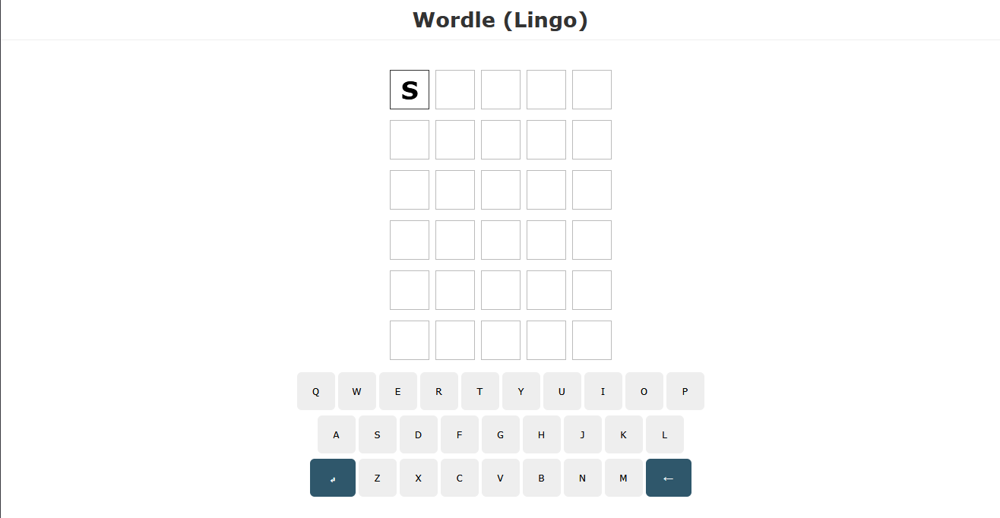
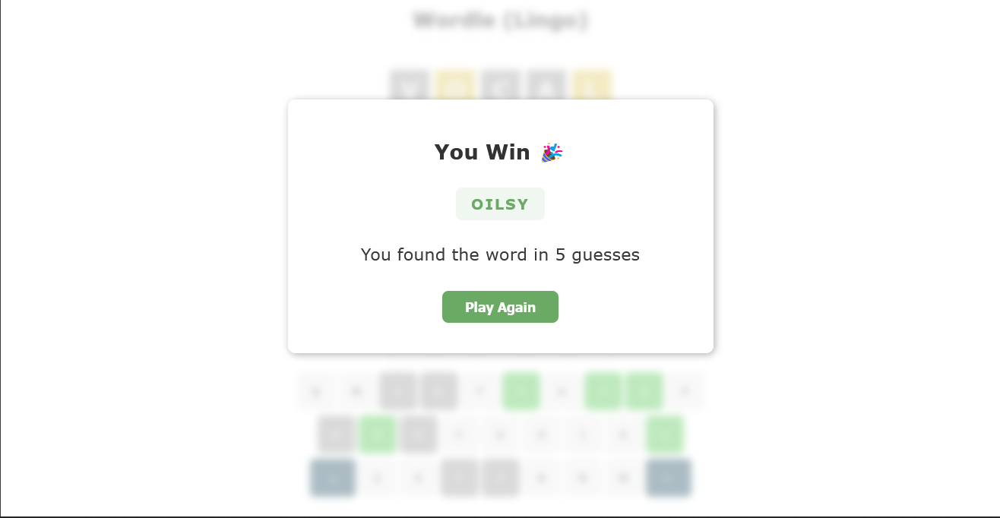
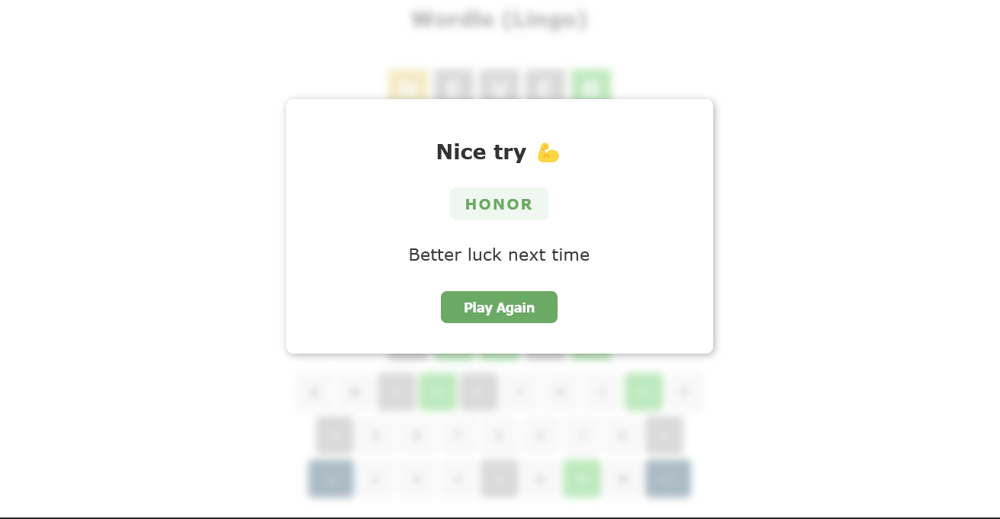

# Wordle Lingo Clone 

A **simple Wordle clone** built with **React + Vite**, playable directly in the browser or locally.

Try it live: [**https://wordle-lingo-clone.vercel.app/**](https://wordle-lingo-clone.vercel.app/)

##  What it does

* Lets you guess 5-letter words, just like Wordle
* Highlights letters as:

  * **Green** – correct spot
  * **Yellow** – wrong spot
  * **Gray** – not in the word
* Simple, clean, and interactive grid
* Retry button lets you start a new game instantly

## Tech used

* **React** – for the UI
* **Vite** – super fast dev environment and build
* **JS + CSS** – lightweight styling
* **Static JSON (`db.json`)** – stores word solutions

## Getting Started (Dev)

Clone the repo:

```bash
git clone https://github.com/ZLouisMiguel/wordle-clone.git
cd wordle-clone
```

Install dependencies:

```bash
npm install
```

Run in development mode:

```bash
npm run dev
```

Open [http://localhost:5173](http://localhost:5173) in your browser.

> The app will automatically fetch a random solution from `db.json` in the `public` folder.


## Live Site

This app is deployed on **Vercel** and works out of the box without any backend:

[**Live Game → https://wordle-lingo-clone.vercel.app/**](https://wordle-lingo-clone.vercel.app/)


## How it works

* **App.jsx** – main component, fetches a random word from `db.json` and passes it to `Wordle`
* **Wordle.jsx** – handles the game logic and game state using the `useWordle` hook
* **Grid.jsx + Row.jsx** – renders the 6x5 guess grid
* **Keypad.jsx** – clickable keyboard input + visual feedback
* **Modal.jsx** – shows win/lose messages with retry option
* **db.json** – static JSON file in `public` storing all solutions


## Features / Ideas for Next Steps

* Local storage to save progress
* UX solution on submission fail
* Color themes / seasonal themes


## License

MIT License feel free to use, fork, and modify.

---
## Preview

### Game Grid

*A typical game in progress, showing guesses and feedback.*

### Win Modal

*Displayed when you guess the word correctly.*

### Lose Modal

*Displayed when you use all attempts without guessing the word.*


